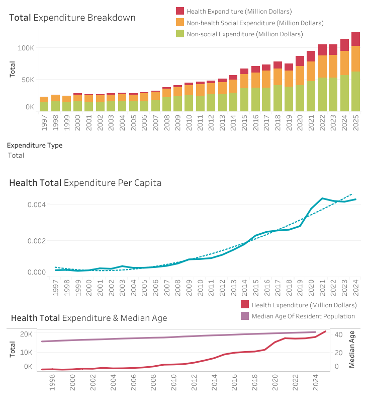

# Government Healthcare Expenditure Analysis
## Project Overview
This project analyses healthcare spending trends in Singapore by examining government expenditure and population datasets. The analysis combines data processing and preparation using Python with interactive visualisations created in Tableau to provide insights into Singapore's healthcare investment patterns over time.

Key Questions Addressed:
- How has healthcare expenditure changed over time?
- What trends can be identified in per-capita healthcare spending?
- What is the relationship between median age and healthcare spending?

## Repository Structure
```
├── data/
│   ├── raw/                    # Original, unprocessed datasets
│   └── processed/              # Cleaned and transformed data
├── Government Healthcare Data Preparation.ipynb     # Python data processing
├── visualisations/
│   └── dashboard_preview.png   # Screenshot of Tableau dashboard
└── README.md                   # Project documentation
```
## Dashboard
[Tableau Public Interactive Dashboard](https://public.tableau.com/views/GovernmentHealthExpenditureAnalysis/Dashboard?:language=en-US&:sid=&:redirect=auth&:display_count=n&:origin=viz_share_link)



## Key Findings
- Increasing total healthcare expenditure, shifting from a small portion of social and total spending to dominating a larger part of government expenditure
- Health operating expenditure saw a greater increase over the years, as compared to health development expenditure
- Steep increase in government healthcare expenditure per capita in recent years
- Clear correlation between increasing median age and healthcare cost

## Data Sources
[Government Development Expenditure](https://tablebuilder.singstat.gov.sg/table/TS/M130591)
[Government Operating Expenditure](https://tablebuilder.singstat.gov.sg/table/TS/M130631)
[Indicators on Population](https://data.gov.sg/datasets/d_3d227e5d9fdec73f3bcadce671c333a6/view)
